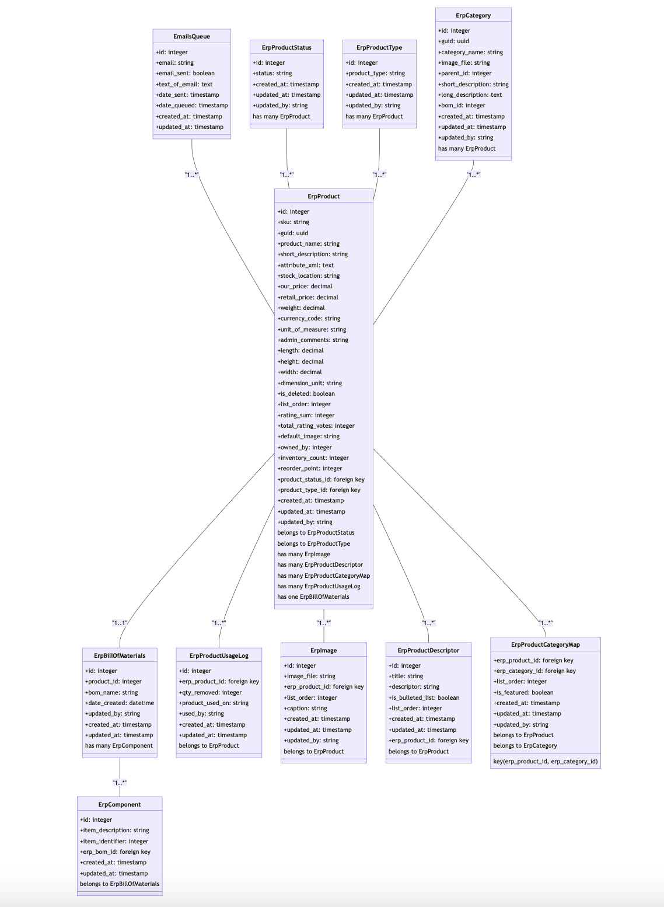
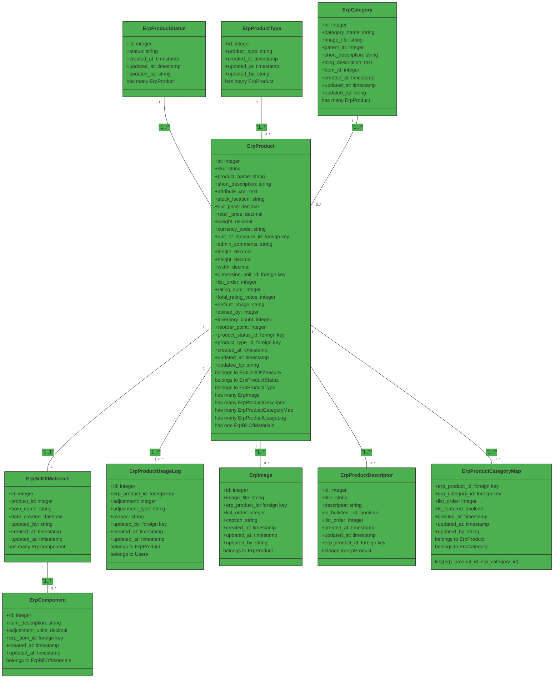

# Invenbin Database Schema

This document provides a comprehensive overview of the Invenbin database schema, including all tables, relationships, and field definitions.

## Schema Diagram

## Entity Relationship Diagram

## Table Definitions

### erp_products

The core table storing all product information.

| Field | Type | Description |
|-------|------|-------------|
| id | integer | Primary key |
| guid | string | Globally Unique Identifier for API access |
| sku | string | Stock Keeping Unit - unique product identifier |
| product_name | string | Product name/title |
| short_description | string | Brief product description |
| attribute_xml | text | XML-encoded product attributes |
| stock_location | string | Physical location of inventory |
| our_price | decimal | Wholesale price |
| retail_price | decimal | Retail price |
| weight | decimal | Product weight |
| currency_code | string | Currency code (e.g., USD, EUR) |
| unit_of_measure_id | foreign key | Reference to erp_unit_of_measure |
| admin_comments | string | Internal admin notes |
| length | decimal | Product length |
| height | decimal | Product height |
| width | decimal | Product width |
| dimension_unit_id | foreign key | Reference to erp_unit_of_measure for dimensions |
| list_order | integer | Display order in listings |
| rating_sum | integer | Sum of all ratings |
| total_rating_votes | integer | Total number of rating votes |
| default_image | string | Default image filename |
| owned_by | integer | Owner/user ID |
| inventory_count | integer | Current inventory quantity |
| reorder_point | integer | Threshold for reordering |
| product_status_id | foreign key | Reference to erp_product_statuses |
| product_type_id | foreign key | Reference to erp_product_types |
| created_at | timestamp | Creation timestamp |
| updated_at | timestamp | Last update timestamp |
| deleted_at | timestamp | Soft delete timestamp (nullable) |
| updated_by | integer | User ID who last updated |

### erp_categories

Stores product categories for organization.

| Field | Type | Description |
|-------|------|-------------|
| id | integer | Primary key |
| category_name | string | Category name |
| image_file | string | Category image filename |
| parent_id | integer | Parent category ID (for hierarchical structure) |
| short_description | string | Brief category description |
| long_description | text | Detailed category description |
| created_at | timestamp | Creation timestamp |
| updated_at | timestamp | Last update timestamp |
| deleted_at | timestamp | Soft delete timestamp (nullable) |
| updated_by | integer | User ID who last updated |

### erp_product_types

Defines product types for classification.

| Field | Type | Description |
|-------|------|-------------|
| id | integer | Primary key |
| product_type | string | Product type name |
| created_at | timestamp | Creation timestamp |
| updated_at | timestamp | Last update timestamp |
| deleted_at | timestamp | Soft delete timestamp (nullable) |
| updated_by | integer | User ID who last updated |

### erp_product_statuses

Defines product status values.

| Field | Type | Description |
|-------|------|-------------|
| id | integer | Primary key |
| status | string | Status name (e.g., Available, Out of Stock) |
| created_at | timestamp | Creation timestamp |
| updated_at | timestamp | Last update timestamp |
| deleted_at | timestamp | Soft delete timestamp (nullable) |
| updated_by | integer | User ID who last updated |

### erp_unit_of_measure

Defines units of measurement.

| Field | Type | Description |
|-------|------|-------------|
| id | integer | Primary key |
| name | string | Unit name (e.g., pieces, kg, liters) |
| symbol | string | Unit abbreviation/symbol |
| created_at | timestamp | Creation timestamp |
| updated_at | timestamp | Last update timestamp |

### erp_boms

Stores bills of materials for complex products.

| Field | Type | Description |
|-------|------|-------------|
| id | integer | Primary key |
| guid | string | Globally Unique Identifier for API access |
| erp_product_id | foreign key | Reference to erp_products |
| bom_name | string | BOM name/description |
| updated_by | integer | User ID who last updated |
| created_at | timestamp | Creation timestamp |
| updated_at | timestamp | Last update timestamp |
| deleted_at | timestamp | Soft delete timestamp (nullable) |

### erp_components

Stores components for bills of materials.

| Field | Type | Description |
|-------|------|-------------|
| id | integer | Primary key |
| erp_product_id | foreign key | Reference to erp_products (component product) |
| item_description | string | Component description |
| adjustment_units | decimal | Quantity adjustment units |
| erp_bom_id | foreign key | Reference to erp_boms |
| created_at | timestamp | Creation timestamp |
| updated_at | timestamp | Last update timestamp |
| deleted_at | timestamp | Soft delete timestamp (nullable) |

### erp_images

Stores product images.

| Field | Type | Description |
|-------|------|-------------|
| id | integer | Primary key |
| image_file | string | Image filename |
| erp_product_id | foreign key | Reference to erp_products |
| list_order | integer | Display order |
| caption | string | Image caption |
| created_at | timestamp | Creation timestamp |
| updated_at | timestamp | Last update timestamp |
| deleted_at | timestamp | Soft delete timestamp (nullable) |
| updated_by | integer | User ID who last updated |

### erp_product_descriptors

Stores product feature descriptions.

| Field | Type | Description |
|-------|------|-------------|
| id | integer | Primary key |
| title | string | Descriptor title |
| descriptor | string | Descriptor content |
| is_bulleted_list | boolean | Whether to display as bulleted list |
| list_order | integer | Display order |
| created_at | timestamp | Creation timestamp |
| updated_at | timestamp | Last update timestamp |
| deleted_at | timestamp | Soft delete timestamp (nullable) |
| erp_product_id | foreign key | Reference to erp_products |

### erp_product_category_maps

Many-to-many relationship between products and categories.

| Field | Type | Description |
|-------|------|-------------|
| erp_product_id | foreign key | Reference to erp_products |
| erp_category_id | foreign key | Reference to erp_categories |
| list_order | integer | Display order within category |
| is_featured | boolean | Whether product is featured in category |
| created_at | timestamp | Creation timestamp |
| updated_at | timestamp | Last update timestamp |
| deleted_at | timestamp | Soft delete timestamp (nullable) |

**Primary Key:** Composite key (erp_product_id, erp_category_id)

### erp_product_usage_log

Tracks inventory adjustments and usage.

| Field | Type | Description |
|-------|------|-------------|
| id | integer | Primary key |
| erp_product_id | foreign key | Reference to erp_products |
| adjustment | integer | Quantity adjusted (positive or negative) |
| adjustment_type | string | Type of adjustment (add, remove, transfer) |
| reason | string | Reason for adjustment |
| updated_by | integer | Reference to users table |
| created_at | timestamp | Creation timestamp |
| updated_at | timestamp | Last update timestamp |
| deleted_at | timestamp | Soft delete timestamp (nullable) |

## Relationships

### One-to-Many Relationships

- **ErpProductStatus** → **ErpProduct**: One status can apply to many products
- **ErpProductType** → **ErpProduct**: One type can apply to many products
- **ErpCategory** → **ErpProduct**: One category can contain many products
- **ErpProduct** → **ErpImage**: One product can have many images
- **ErpProduct** → **ErpProductDescriptor**: One product can have many descriptors
- **ErpProduct** → **ErpProductUsageLog**: One product can have many usage logs (table: erp_product_usage_log)
- **ErpBillOfMaterials** → **ErpComponent**: One BOM can have many components

### Many-to-Many Relationships

- **ErpProduct** ↔ **ErpCategory**: Products can belong to multiple categories via erp_product_category_map

### One-to-One Relationships

- **ErpProduct** → **ErpBillOfMaterials**: One product can have one BOM (optional, table: erp_boms)

### Foreign Key Relationships

- **ErpProduct.unit_of_measure_id** → **erp_units_of_measure.id**
- **ErpProduct.dimension_unit_id** → **erp_units_of_measure.id**
- **ErpProduct.product_status_id** → **erp_product_statuses.id**
- **ErpProduct.product_type_id** → **erp_product_types.id**
- **ErpBillOfMaterials.erp_product_id** → **erp_products.id**
- **ErpComponent.erp_bom_id** → **erp_boms.id**
- **ErpComponent.erp_product_id** → **erp_products.id**
- **ErpImage.erp_product_id** → **erp_products.id**
- **ErpProductDescriptor.erp_product_id** → **erp_products.id**
- **ErpProductUsageLog.erp_product_id** → **erp_products.id**
- **ErpProductUsageLog.updated_by** → **users.id**

## Indexes

Recommended indexes for performance:

- `erp_products.sku` (unique)
- `erp_products.product_name` (index)
- `erp_products.product_status_id` (index)
- `erp_products.product_type_id` (index)
- `erp_categories.parent_id` (index)
- `erp_product_category_maps.erp_product_id` (index)
- `erp_product_category_maps.erp_category_id` (index)
- `erp_product_usage_log.erp_product_id` (index)
- `erp_product_usage_log.created_at` (index)

## Data Integrity

### Constraints

- **erp_product_category_map**: Composite primary key ensures unique product-category pairs
- **Foreign keys**: All foreign key relationships are enforced
- **Not null**: Required fields are marked as not null in migrations

### Validation Rules

- SKU must be unique
- Inventory count cannot be negative
- Reorder point must be non-negative
- Prices must be non-negative
- List order values must be non-negative

## Migration Files

The schema is created through Laravel migrations located in:
`packages/faxt/invenbin/database/migrations/`

Main migration: `2024_04_11_123455_create_erp_tables.php`

## Key Differences from Documentation

### GUID Support
- **erp_products** and **erp_boms** include a `guid` field for API access
- GUIDs are auto-generated on creation via ErpBaseModel

### Soft Deletes
- All tables except `erp_unit_of_measure` include `deleted_at` for soft deletes
- Implemented via Laravel's SoftDeletes trait in ErpBaseModel

### Field Name Changes
- `erp_unit_of_measure` uses `name` and `symbol` instead of `unit_name` and `abbreviation`
- `erp_boms` table name (plural) instead of `erp_bill_of_materials`
- `erp_product_usage_log` (singular) instead of `erp_product_usage_logs` (plural)
- `erp_components` includes `erp_product_id` to link to component products

### Audit Fields
- `updated_by` is an integer (user ID) instead of string (username)
- Auto-populated via ErpBaseModel boot method

### Removed Fields
- `erp_categories` no longer has `bom_id` field
- `erp_boms` no longer has `date_created` field (uses `created_at` instead)
